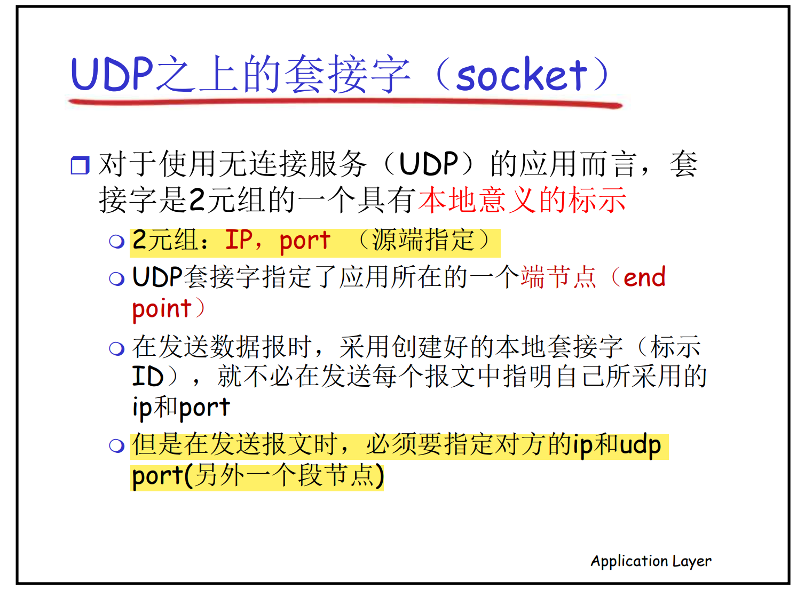

# 计算机网络

## 基础知识

+ FTP默认21/20端口, http默认80端口

### `URL`

统一资源定位符（英语：`Uniform Resource Locator`，缩写：URL，或称统一资源定位器、定位地址、URL地址[1]）俗称网页地址，简称网址，是因特网上标准的资源的地址（Address），如同在网络上的门牌。它最初是由蒂姆·伯纳斯-李发明用来作为万维网的地址，现在它已经被万维网联盟编制为因特网标准RFC 1738。

### `E-Mail` `FTP(File Transfer protocol`

发送电子邮件用到的协议`simple Mail Transfer Protocol`

文件传输协议`File Transfer Protocol` 在FTP中进行文件传输会建立两个TCP连接,分别是**发出传输请求时所要的控制连接**和**实际传输数据的数据连接** 

### `TTL(Time to Live)`

>TTL是 Time To Live的缩写，该字段指定IP包被路由器丢弃之前允许通过的最大网段数量。TTL**是IPv4报头的一个8 bit字段**。
注意：TTL与DNS TTL有区别。二者都是生存时间，前者**指ICMP包的转发次数（跳数）**，后者指域名解析信息在DNS中的存在时间
time to live（生存周期）一个报文每经过一跳就将ttl值减1，当ttl为零时，该报文被丢弃，在traceroute中，**当TTL减为0，会向端系统发送一个ICMP**。默认ttl为255

### `ICMP`

>ICMP（Internet Control Message Protocol）Internet控制报文协议。**它是TCP/IP协议簇的一个子协议，用于在IP主机、路由器之间传递控制消息。控制消息是指网络通不通、主机是否可达、路由是否可用等网络本身的消息**。这些控制消息虽然并不传输用户数据，但是对于用户数据的传递起着重要的作用。
ICMP使用IP的基本支持，就像它是一个更高级别的协议，但是，ICMP实际上是IP的一个组成部分，必须由每个IP模块实现。

### `Tracerroute`

>程序利用增加存活时间（TTL）值来实现其功能。每当数据包经过一个路由器，其存活时间就会减1。当其存活时间是0时，主机便取消数据包，并传送一个ICMP TTL数据包给原数据包的发出者。
**程序发出的首3个数据包TTL值是1，之后3个是2，如此类推，它便得到一连串数据包路径。注意IP不保证每个数据包走的路径都一样**。
基于UDP实现和基于ICMP实现

### **吞吐量**

> 三者取最小 min(Rc,Rs,1/N)

### `Protocol Data Unit`

**协议数据单元**(`Protocol Data Unit`)，是指在分层网络结构，例如在开放式系统互联（OSI）模型中，在传输系统的每一层都将建立协议数据单元（PDU）。

>`What Does Protocol Data Unit (PDU) Mean?`
A protocol data unit (PDU) is an open-system interconnection (OSI) term used **in telecommunications** that **refers to a group of information added or removed by a layer of the OSI model**. Each layer in the model uses the PDU to communicate and exchange information, which can only be read by the peer layer on the receiving device and is then handed over to next upper layer after stripping.
协议数据单元 （PDU） 是电信中使用的开放系统互连 （OSI） 术语，指的是由 OSI 模型的一层添加或删除的一组信息。模型中的每一层都使用PDU进行通信和交换信息，这些信息只能由接收设备上的对等层读取，然后在剥离后移交给下一个上层。
`Techopedia Explains Protocol Data Unit (PDU)`
A protocol data unit is information delivered as a unit among peer entities of networks containing control information, address information or data. In layered systems, PDU represents a unit of data specified in the protocol of a given layer, which consists of protocol control information and user data.
协议数据单元是作为一个单元在网络的对等实体之间传递的信息，其中包含控制信息、地址信息或数据。在分层系统中，PDU表示在给定层的协议中指定的数据单元，它由协议控制信息和用户数据组成。
PDU is a significant term related to the initial four layers of the OSI model. In Layer 1, PDU is a **bit**, in Layer 2 it is a **frame**, in Layer 3 it is a **pack**et and in Layer 4 it is a **segment**. In Layer 5 and above, PDU is referred to as **data**.(国内一般叫`message`报文)
PDU 是与 OSI 模型的初始四层相关的重要术语。在第 1 层中，PDU 是位，在第 2 层中是一个帧，在第 3 层中是数据包，在第 4 层中是一个段。在第 5 层及更高层中，PDU 称为数据。
PDU has four fields: the destination service access point, source service access point, control field and information field. In packet-switched data networks, PDU is related to a service data unit.
PDU 有四个字段：目标服务接入点、源服务接入点、控制字段和信息字段。在分组交换数据网络中，PDU 与业务数据单元相关。

> 协议数据单元PDU（Protocol Data Unit）是指对等层次之间传递的数据单位。 协议数据单元(Protocol Data Unit )物理层的 PDU是数据位（bit），数据链路层的 PDU是数据帧（frame），网络层的PDU是数据包（packet），**传输层的 PDU是数据段（segment）**，其他更高层次的PDU是报文（**message**）。说白了，pdu就是某协议发送数据的基本单位，各协议有各自的格式。实际使用中其实很多人其实不太分这么细，统一称作数据包。

### `Service Accessing point`服务访问点

>SAP（Service Access Point）是上层**访问下层所提供服务**的点。在计算机体系结构中，**下层是为相邻上层提供服务的，而下层对它的所有上层都是透明的**。
SAP是临层实体（“实体”也就是对应层的逻辑功能）间实现相互通讯的逻辑接口，位于两层边界处。**从物理层开始，每一层都向上层提供服务访问点（应用层除外），每一层都有SAP，但不同层的SAP内容和表示形式是不一样的。**

### `primitive`原语(`socket`套接字编程是一种原语)

> 服务提供者用**原语**向使用者提供服务

### `PDU-SDU`

+ `SDU(Service Data Unit)`

>服务数据单元，又叫业务数据单元，是指定层的用户服务的数据集，传送到接收方的时候同一协议层时数据没有发生变化，即业务部分，**然后发给下层之后，下层将其封装在PDU中发送出去**。服务数据单元是**从高层协议来的信息单元传送到低层协议**。
上层来了`SDU`,然后本层加上`n-header`等头部信息组成`n-PDU`.

### `Internet`五层协议栈

## `Encapsulation`(封装与解封装)

## 分布式进程通信需要解决的问题

## `UDP`

## `UDP's Necessity`

 

## `SSL`的作用

# `Web` and `HTTP`

## http连接 1.0(非持久化) and 1.1

## 非持久化http 连接图示

## 持久化http

在请求过后对象还没回来时便发出下个请求

## `HTTP`报文

## `Cookies`

## HTTP本地缓存

